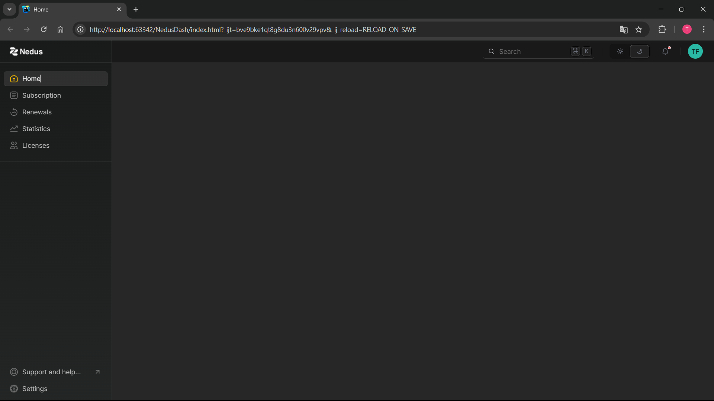
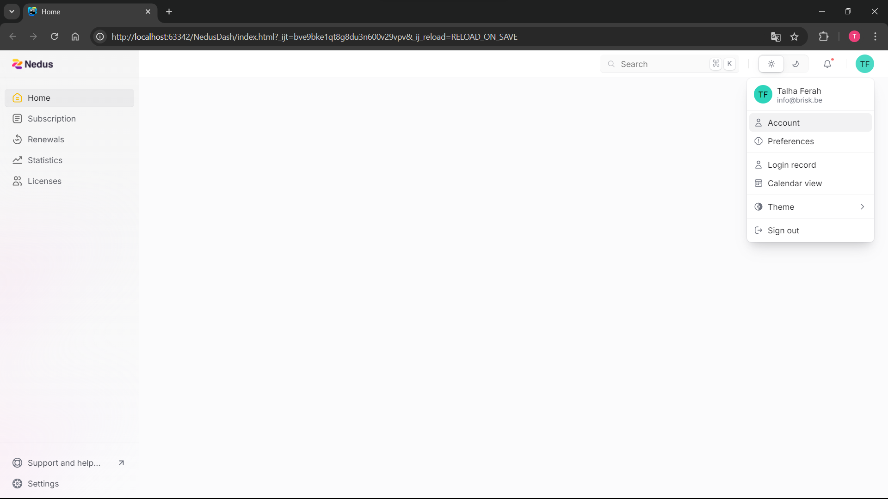
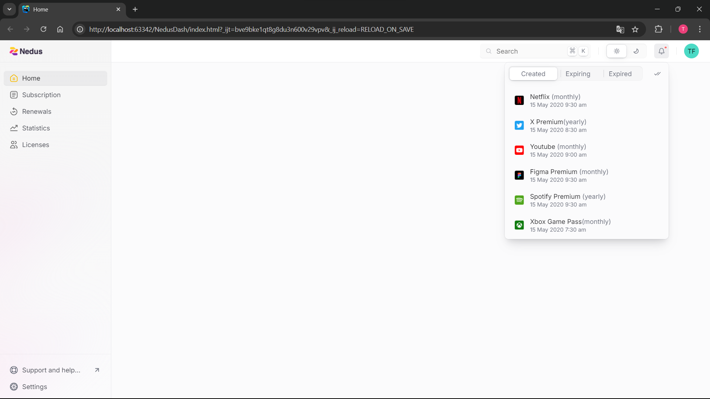

# Dashboard 
Dit project is een volledig door mij ontwikkeld dashboard gebouwd tijdens mijn stage om mijn vaardigheden op te warmen en verder te ontwikkelen. 
Het dashboard is ontworpen met HTML, CSS en JavaScript en bevat zowel een light als dark mode.

# 🎨 Ontwerp
Het ontwerp van het dashboard is geleverd in Figma door mijn werkplekcoach en ik heb het ontwikkeld met speciale aandacht voor pixel-perfecte ontwikkeling.

# Screenshots

